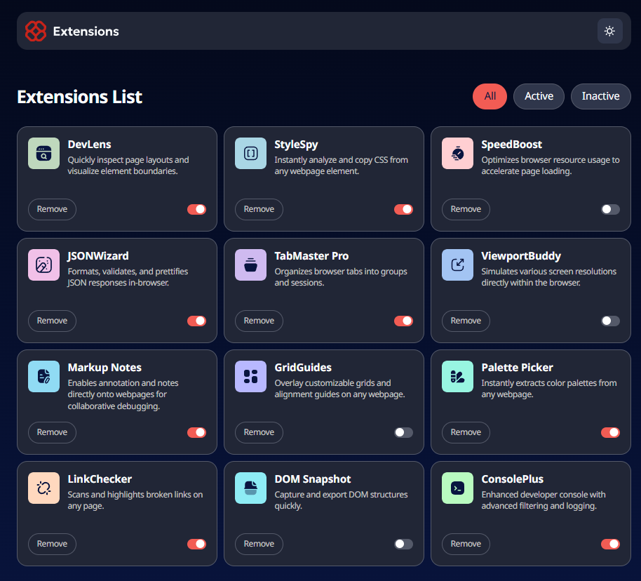

Minimal ama öğretici bir React projesi. Tarayıcı eklentisi kontrol paneli gibi çalışan bu Single Page App, **global state yönetimi**, **`useMemo` optimizasyonları**, ve **prop drilling/pruning** konularında kendimi geliştirmek için yazıldı.

## ✨ Özellikler

- ⚛️ React 19 ile modern component mimarisi  
- 📘 TypeScript ile type-safe geliştirme  
- 🧠 `useMemo` ile performanslı renderlar  
- 🌍 Global state yönetimi (context vs alternative yaklaşımlar)  
- 🧩 Modüler ve reusable component yapısı  
- 🎯 Gerçek dünya senaryosuna benzer bir browser extension UI mantığı

---

## 🧠 Neleri Pekiştirdim?

- 🔁 Global state vs prop drilling farkları
- 🚀 Memoization’ın render performansına etkisi
- ⚡️ Tailwind ile hızlı UI prototipleme
- 🔍 React component tree ve veri akışı yönetimi
- 📦 Kod okunabilirliği ve component modülerliği

---

## 🛠️ Kurulum

```bash
git clone https://github.com/kullaniciadi/extension-ui-clone
cd extension-ui-clone
npm install
npm run dev
```
---
---

## 🌟 Projeyi Beğendin mi?

Bir ⭐ bırakıp repo'yu desteklersen çok sevinirim!  
Yıldız atmak ücretsizdir, faydası boldur. 😎

---


